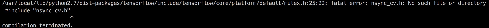
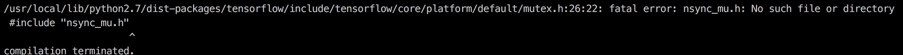

# InceptText-Tensorflow
An Implementation of the alogrithm in paper IncepText: A New Inception-Text Module with Deformable PSROI Pooling for Multi-Oriented Scene Text Detection

## Introduction
### Tensorflow=1.4.0

### Preparation

1.gcc 4.9

2.cuda8.0

3.cd lib && make

- 可能遇到的错误：

1.

解决办法：把cuda路径添加到系统环境变量，然后改为#include<cuda.h>

2.

解决办法：找到nsync_cv.h的绝对路径然后include

3.

解决办法：找到nsync_mu.h的绝对路径然后include

## Download
### 1.Models trained on ICDAR 2017
### 2.Resnet V1 50 provided by tensorflow slim[ResNet-v1](http://download.tensorflow.org/models/resnet_v1_50_2016_08_28.tar.gz)

## Train
### python train_main.py

## Test
### python test.py
